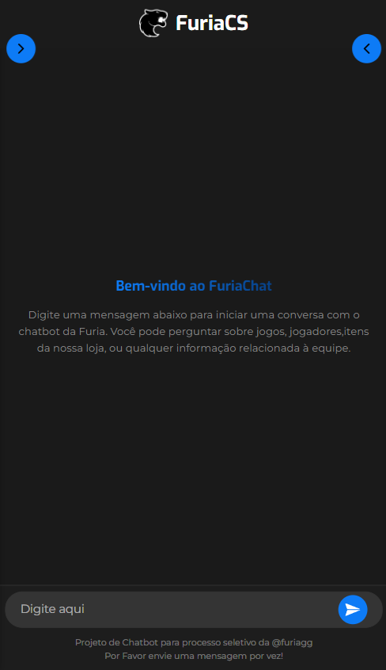
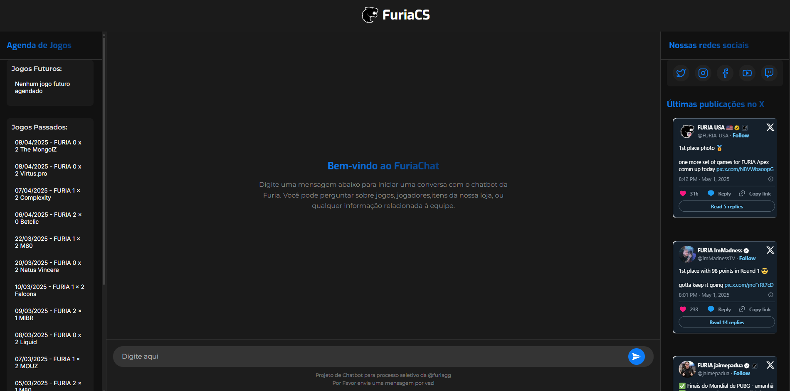

#  FURIA Chatbot


Um chatbot inteligente especializado no time de CS2 da FURIA Esports. Responde perguntas sobre jogadores, partidas, estatísticas, loja oficial, e muito mais — utilizando uma LLM local com RAG em um modelo em formato GGUF.

### Acesse em: [FuriaChatbot](http://furiachat.kloresec.io/)

 

---

## 🚀 Tecnologias utilizadas

- ⚙️ **Backend**: [FastAPI](https://fastapi.tiangolo.com/)
- 🌐 **Frontend**: [Next.js](https://nextjs.org/)
- 🧠 **Modelo LLM**: [Nous Hermes 3 - LLaMA 3.1 8B (GGUF)](https://huggingface.co/NousResearch/Hermes-3-Llama-3.1-8B-GGUF) com RAG
- 🧾 **Formato do modelo**: GGUF (usando `llama.cpp`)
- 🔍 **Dados em tempo real**: Scraping da HLTV
  

---

## 📁 Estrutura do Projeto

```
Furia-Chatbot/
├── api/
     └── models/Hermes-3-Llama...    # Modelo GGUF                       
├── frontend/                    # Frontend Next.js
└── README.md
```

---

## 🛠️ Como rodar o projeto localmente
### 0. Requsisitos Iniciais
  - Recomendável rodar em uma máquina com pelo menos 8gb de Ram LIVRE<br>
  - Instale Python, pip e venv<br>
  - Instale o Node.js e npm<br>
  - Instale o Chrome + ChromeDriver em versões compatíveis 

### 1. Clone o repositório

```bash
git clone https://github.com/PedroLarchert/furia-chatbot.git
cd furia-chatbot
```

### 2. Baixar modelo LLM 

```bash
cd Furiacs-Chatbot/api
python -m venv nome_do_ambiente (cria um ambioente virtual python)


nome_do_ambiente/bin/activate (Linux/macOS)
ou
nome_do_ambiente\Scripts\activate (Windows). (ativar o ambiente)

pip install -r requirements.txt
python download_model.py

```
### 3. Rodar o backend (FastAPI)

```bash

uvicorn main:app --reload
ou
fastapi dev main.py
```

### 4. Rodar o frontend (Next.js)

```bash
cd Furiacs-Chatbot/frontend
npm install
npm run dev
```
### Observações:
> - A velocidade das respostas do chat depende do poder computacional da máquina, se a máquina tiver nucleos Cuda, é ainda melhor.<br>
> - Se tiver nucleos Cuda antes de iniciar de rodar o backend, Você pode rodar LLAMA_CUBLAS=1 pip install llama-cpp-python --force-reinstall, para utilizá-los em vez de usar a CPU
> - O chat pode cometer erros e fugir do contexto em alguns casos, como utiliza um modelo pequeno e quantizado, ele pode fugir algumas vezes do prompt e alucinar, inventando informações.<br>
> - O projeto atualmente utiliza o modelo Hermes 3 - LLaMA 3.1 8B em formato `.gguf`, rodando localmente com `llama-cpp-python`, mas também é compatível com execução via binário manual (`llama-cli`) ou LM Studio.<br>
> - Em caso de problemas para rodar localmente, você pode acessar pelo link: [http://furiachat.kloresec.io/](http://furiachat.kloresec.io/)<br>

###  Outras formas de rodar o modelo LLM:

####  Padrão (integrado ao backend): `llama-cpp-python`

O modelo roda dentro do Python e responde diretamente via FastAPI.

```python
from llama_cpp import Llama
llm = Llama(model_path="api/models/Hermes-3-Llama-3.1-8B.Q4_K_M.gguf")
```

####  Alternativa 1 – CLI compilado (`llama.cpp`)

Você pode clonar e compilar manualmente:

```bash
git clone https://github.com/ggerganov/llama.cpp
cd llama.cpp
cmake -B build
cmake --build build
./build/bin/llama-cli -m path/para/seu/modelo.gguf
```

####  Alternativa 2 – LM Studio

Ferramenta com interface gráfica que permite rodar o modelo e expor uma API local em:
```
http://localhost:1234/v1/chat/completions
```

Basta configurar o modelo `.gguf` e usar chamadas HTTP compatíveis com OpenAI.

---

> O modelo deve estar salvo em `api/models/Hermes-3-Llama-3.1-8B.Q4_K_M.gguf`
> o arquivo api/sendToLLM.py, possui o esqueleto para enviar requests http para a llm que estiver rodando em um servidor no modelo de chat/completions


---

## 📌 Funcionalidades

- 🧠 Chatbot treinado com conhecimento sobre a FURIA e CS2
- 📅 Agenda de partidas (via scraping)
- 📊 Resultado de jogadores
- 🛒 Informações sobre a loja oficial
- 👍Últimos tweets no x (via scraping)

---

## Desafios enfrentados no projeto

Durante o desenvolvimento do projeto, alguns obstáculos técnicos exigiram soluções alternativas. Entre os principais desafios, destacam-se:

#### Encontrar um modelo LLM reduzido e quantizado satisfatório 
Depois de muitos testes com modelos de LLM, alguns modelos maiores inclusive, com 8B e 9B com quantização mais precisa, que não obtiveram resultados tão bons quanto os desse pequeno modelo.<br>
De certo que há muitos modelos maiores, que trariam respostas melhores para esta tarefa,mas que exigiriam poder computacional muito grande para um processo local, fugindo do próposito deste projeto<br>
Inclusive uma opção para esse projeto seria utilizar as Apis de LLMs pagas como da OpenAI ou da Deepseek

#### Scraping e status ao vivo

O objetivo era mostrar o status "ao vivo" de partidas da FURIA,e integrar esses dados, ao conjunto de dados que faz parte do RAG para a LLM, incluindo placar parcial, mapas e informações de picks/bans. Inicialmente, tentou-se fazer scraping do site da HLTV.org. No entanto, esse site implementa diversos bloqueios contra scraping nas página com as informações das partidas, como:

Cloudflare e verificação JavaScript

Necessidade de simular um navegador real

Mudanças frequentes na estrutura HTML

 Solução utilizada: foi feito um script com Selenium e user-agent customizado para testes locais, inadequado para ambientes de produção, o mais adequado seria utilizar uma API paga oficial com suporte garantido a dados em tempo real.

---

## 👨‍💻 Autor

Desenvolvido por [Pedro Vitório Larchert de Oliveira](https://github.com/PedroLarchert)  
📫 Entre em contato para colaborações!

---

## 📄 Licença

Este projeto é livre para uso educacional e experimental. Para uso comercial, entre em contato.
